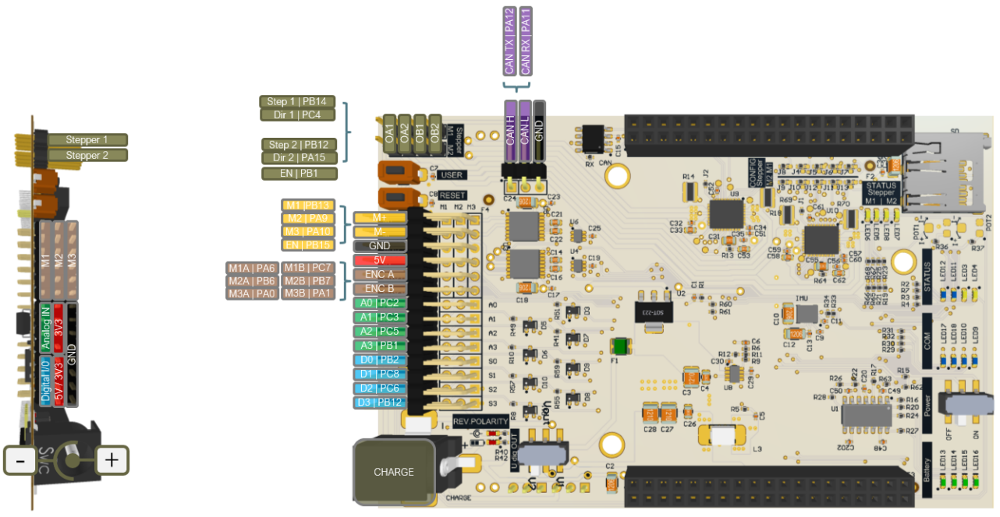

<!--
    Styling Rules:
    - When ever possible *.md [Links] should be used, and not just bold text
    - In a *.md [Link] all words start with a capital letter, e.g.: [Course setup]
    - A button or a pin or something similar is highlited bold: **USER BUTTON**, **PB_9**
    - Source code files are highlited bold and cursive: ***main.cpp***
    - Functions, objects and variables when not in a code snippet are formatted like this:
      - ``main()`` function
      - ``servo.enable()`` function
      - ``while()`` loop
      - ``if()`` statement
      - ``mechanical_button`` object
      - ``enable_motors`` variable
      - ``DCMotor.h`` driver
    Authors:
    - Michael Peter (pichim/pmic)
    - Maciej Szarek (szar)
 -->

 <!--
    Info about the demonstrators for WS2 and WS3:

    In the folders [/docs/cad/WS2](/docs/cad/WS2) and [/docs/cad/WS3](/docs/cad/WS3) you will find the printable files needed to build the demonstration models for workshop 2 and workshop 3. For workshop 3, you need to edit the parts rack and gear wheel because they are only available in STL print-ready format. Editing can be done in Prusa Slicer, which offers the possibility of minor modification.

    - Rack - one hole should be added, in order to screw the rack to the carriage on which the sensor is located, or possibly lengthen this element (details available: https://www.printables.com/de/model/522220-universal-gear-rack-collection-different-modules)
    - Make a hole in the element for the motor shaft (details available: https://www.printables.com/de/model/516177-universal-spur-gears-collection-module-15)
-->

 <!--
    TODO: General:
    - document how to use PlatformIO
    - document how to use Putty
    - add Python evaluation files for IR sensor calibration
    - revisit and clean up sd card writer stuff
    - create sd card example
    - create serial stream example
    - include serial stream python version (in addition to matlab version)
    - in DCMotor.cpp PERFORM_GPA_MEAS and PERFORM_CHIRP_MEAS should be tested with the latest updates, here features like serial_pipe and serialStream could be introduced

    Files checked before FS25:

        Markdown files read and checked:
        - README.md (some TODO's left)
        - build_mbed_linux.md   (ok)
        - build_mbed_windows.md (ok)
        - stepper_motor.md      (ok)
        - course_setup.md       (ok)
        - dc_motor.md           (ok)
        - imu.md                (ok)
        - ir_sensor.md          (ok)
        - kinematics.md         (ok)
        - line_follower.md      (ok)
        - main_description.md   (ok)
        - servo.md              (ok)
        - tips.md               (ok)
        - ultrasonic_sensor.md  (ok)
        - ws1.md                (ok)
        - ws2.md                (ok)
        - ws3.md                (ok)

        Solutions:
        - main_base.cpp                       (ok)
        - main_calib_kinematic_ss24.cpp       (ok)
        - main_gimbal.cpp                     (ok)
        - main_line_follower.cpp              (ok)
        - main_line_follower_base_ss24.cpp    (ok)
        - main_pes_monster.cpp                (ok)
        - main_sd_card_writter_unfinished.cpp
        - main_stepper_motor.cpp              (ok)
        - main_ws1.cpp                        (ok)
        - main_ws1_ir_sensor_class.cpp        (ok)
        - main_ws2_p1.cpp                     (ok)
        - main_ws2_p2.cpp                     (ok)
        - main_ws3_p1.cpp                     (ok)
        - main_ws3_p2.cpp                     (ok)
  -->

<!-- link list -->
[0]: https://os.mbed.com/platforms/ST-Nucleo-F446RE/
[1]: https://www.st.com/en/microcontrollers-microprocessors/stm32f446re.html#documentation

# PES Board - Hardware and Driver Documentation

| Michael Peter | Michael Wüthrich | Camille Huber |
| ------------- | ---------------- | ------------- |
| pmic@zhaw.ch  | wuem@zhaw.ch     | hurc@zhaw.ch  |
| TE 307        | TE 301           | TE 307        |

Big shoutout to Maciej Szarek for his help and the support (https://github.com/szar99).

      
    <i>Fast Prototyping does not to be perfect</i>

Fast prototyping in robotics focuses on quickly building and testing a simple version of the system rather than aiming for perfection from the start. Through iterative development, each prototype helps identify and fix issues, leading to gradual improvements. This approach saves time and cost, encourages experimentation, and ensures that the final design is optimized based on real-world performance. Additionally, hardware and software evolve together, allowing adjustments to both as new challenges arise. Instead of spending too much time planning, build, test, and refine — learning from each iteration.

# Table of Contents
1. [Course Setup](#course-setup)
    * [Accounts](docs/markdown/course_setup.md#accounts)
    * [Software](docs/markdown/course_setup.md#software)
    * [GitHub](docs/markdown/course_setup.md#github)
    * [Arm Mbed](docs/markdown/course_setup.md#arm-mbed)
2. [Hardware](#hardware)
    * [Nucleo F446RE](#nucleo-f446re)
        * [Nucleo Pinmap][0]
    * [PES Board](#pes-board)
        * [Pheripherals](#pheripherals)
        * [Pin-Mapping](#pin-mapping)
    * [Hardware Tutorials](#hardware-tutorials)
        * [IR Sensor](docs/markdown/ir_sensor.md)
        * [Ultrasonic Sensor](docs/markdown/ultrasonic_sensor.md)
        * [Servo](docs/markdown/servo.md)
        * [DC Motor](docs/markdown/dc_motor.md)
        * [Line Follower](docs/markdown/line_follower.md)
3. [Tips](#tips)
    * [Project Development](docs/markdown/tips.md#project-development)
    * [Programming](docs/markdown/tips.md#programming)
        * [Main file description](docs/markdown/main_description.md)
    * [Structuring a Robot Task](docs/markdown/tips.md#structuring-a-robot-task)
4. [Workshops, Solutions and Examples](#workshops)
    * [Workshop 1](docs/markdown/ws1.md)
    * [Workshop 2](docs/markdown/ws2.md)
    * [Workshop 3](docs/markdown/ws3.md)
5. [Build Mbed OS projects with VScode](#build-mbed-os-projects-with-vscode)
    * [Build Mbed on Windows with VScode](docs/markdown/build_mbed_windows.md)
    * [Build Mbed on Linux/WSL with VScode](docs/markdown/build_mbed_linux.md)
6. [Weblinks](#weblinks)

## Course Setup

In order to be able to complete the course, one must first register on the following platforms and obtain the appropriate tools. All the information needed to start the course can be found in [Course Setup](docs/markdown/course_setup.md).

This document covers all the information about: 

- [Accounts](docs/markdown/course_setup.md#accounts)
- [Software](docs/markdown/course_setup.md#software)
- [GitHub](docs/markdown/course_setup.md#github)
- [Arm Mbed](docs/markdown/course_setup.md#arm-mbed)
  
## Hardware

During the course, we will use the Nucleo-F446RE board from ST Microelectronics in combination with the PES board designed and developed at ZHAW. The basic hardware kid that students receive includes a variety of sensors and actuators for practical applications.

>**IMPORTANT NOTE:**
>
>- <b>When working with hardware (connecting, reconnecting etc.), it is recommended that all power sources are disconnected. This is a general safety measurement! So for us, the Nucleo is disconnected and the PES board **Power Switch** is **OFF** when ever we change someting at the hardware setup.</b>
>- <b>The USB cable should only be connected to the computer after the power switch has been switched on.</b>
>- <b>To not connect the charger when the battery packs are not connected, otherwise the PES board will be damaged.</b>
>- <b>Using the PES board with power ON and hardware running while connected to your computer/laptop happens at your own risk. There was a case where the students laptop was damaged in the past.</b>
>- <b>Various Nucleo boards, PES Borads and even laptops have been damaged in the past, so make sure to stick to the rules above.</b>

### Nucleo F446RE

The Nucleo-F446RE is a microcontroller development board featuring the STM32F446RET6 microcontroller from ST Microelectronics. It provides a versatile platform for prototyping and developing embedded systems, offering a wide range of peripherals, connectivity options, and compatibility with the Arduino and ST Morpho ecosystems.

- [STM32F446RE Documentation][1] 

      
    <i>Nucleo F446RE Overview</i>

Arm Mbed provides a dedicated platform with essential information about the development board. Here you can find technical specifications and the pinmap.

- [Mbed ST-Nucleo-F446RE][0]

### PES Board

The PES board is a hardware board with additional sensors, devices and power electronics to work in combination with the Nucleo F446RE. It provides multiple pinouts for:

- 3 DC-Motor (brushed)
- 4 Servos (these occupy the 4 DI/O if used)
- 4 DI/O, 3.3V (5V tolerant)
- 4 AI/O, 3.3V (5V tolerant)
- 3 Encoder-Counter
- 9-axis IMU (accelerometer, gyroscope, magnetometer)
- SD-Card slot

>**IMPORTANT NOTE:**
>- <b>The voltage of the DO (servos) is set via the switch behind the charging socket: 3.3V or 5V. Generally this can be set to 5V.</b>
>- <b>Motor encoder soldering can be wrong. Do not assume that if you plug in one motor and everything works you can then also use the same connections with a different motor. You have to make sure that the physical rotation is according to your needs and that a positive input leads to a positive change of increments.</b>
>- <b>Depending on the PES board version DCMotor M3 rotation direction might be inverted.</b>
>- <b>Depending on the PES board version the Pin map might differ. Feel free to ask if you are not sure.</b>

#### Batteries

The kit includes two sets of 6V battery packs, which can be connected in series to provide 12 volts. The battery packs need to be connected to the back of the PES Board. The picture below illustrates the proper battery connection required to get a total voltage of 12V.

      
    <i>Battery Packs</i>

The batteries enables the board itself to be powered independently of the connection to the computer/laptop, eliminating the need for a connection via the Mini USB cable. The board continues to receive a stable 5V supply while offering the option to use up to 12V supply for the power electronics of the motors. To activate the external battery power, switch the slider on the PES board to the ON position.

<b>Single battery pack</b> - if you are using a single battery pack, the remaining pins need to be bridged. If only 6 V is used, this must be parameterised accordingly in the firmware when parameterising classes of hardware.

#### Charging the Batteries

<b>Using the Charger</b> - if you connect the charger to the PES board, the battery packs need to be connected. If the battery packs (2 packs for 12 volts or one pack and a jumper for 6 volts) are not connected when you plug in the charger, the PES board will be destroyed.

<b>Charging batteries</b> - the battery packs are only charged when the power switch is set to OFF.

<b>Usage while charging</b> - don't use the PES board while it is charging.

#### Resources

All additional technical information such as schematics and pin maps for the PES board can be found in a folder [/docs/datasheets/pes_board_data](/docs/datasheets/pes_board_data). Also included there are CAD files of the combined Nucleo F446RE and PES board in `.3dxml` extensions (for 3Dexperience).

#### Pheripherals

      
    <i>PES Board Pheripherals</i>

- [pes_board_peripherals.pdf](docs/datasheets/pes_board_peripherals.pdf)

#### Pin-Mapping

- [pes_board_pin_mapping.pdf](docs/datasheets/pes_board_pin_mapping.pdf)

### Hardware Kit

- 2x Battery packs 6v / 2300mAh with charger
- 1x Servo – REELY S-0090
- 1x Servo – FUTABA S3001
- 1x LED green with resistor 2200/600mW/1%
- 1x Distance sensor SHARP GP2YOA41 analog 300mm with cable
- 1x DC Motor POLOLU (different gear ratios) D = 20 mm/ l = 43 mm/ 12V with encoder POLOLU 2.7 – 18V
- 1x Mechanical Button
- 1x Ultrasonic sensor GROVE ULTRASONIC RANGER V2.0 with cable

### Hardware Tutorials

The following links contain the hardware tutorials. The documents contain specifications and technical information about the hardware itself and how to use it. The tutorials cover the software drivers, specific calibration procedures, controlling actuators and retrieving measurements from the sensors and actuators.

**Important Note: The PES board currently does not support stepper motors. The following example uses an external hardware driver and an additional battery pack, which is directly wired to the Nucleo board.**

- [IR Sensor](docs/markdown/ir_sensor.md)
- [Ultrasonic Sensor](docs/markdown/ultrasonic_sensor.md)
- [Servo](docs/markdown/servo.md)
- [DC Motor](docs/markdown/dc_motor.md)
- [Line Follower Array](docs/markdown/line_follower.md)
- [IMU](docs/markdown/imu.md)
- [Stepper Motor](docs/markdown/stepper_motor.md)
- [SD-Card] <!-- TODO: Create and add document --> 

## Tips

Tips that you might find useful can be found in the document [Tips](docs/markdown/tips.md). Here you can find information about:

- [Project Development](docs/markdown/tips.md#project-development)
- [Programming](docs/markdown/tips.md#programming)
- [Structuring a Robot Task](docs/markdown/tips.md#structuring-a-robot-task)

## Workshops

The following links contain the workshops instructions:
- [Workshop 1](docs/markdown/ws1.md)
- [Workshop 2](docs/markdown/ws2.md)
- [Workshop 3](docs/markdown/ws3.md)

And below you find all the solutions, as well as some additional examples:
- [Solution Workshop 1](docs/solutions/main_ws1.cpp)
- [Solution Workshop 2, Part 1](docs/solutions/main_ws2_p1.cpp)
- [Solution Workshop 2, Part 2](docs/solutions/main_ws2_p2.cpp)
- [Solution Workshop 3, Part 1](docs/solutions/main_ws3_p1.cpp)
- [Solution Workshop 3, Part 2](docs/solutions/main_ws3_p2.cpp)
- [Example Line Follower](docs/solutions/main_line_follower.cpp)
- [Example Gimbal](docs/solutions/main_gimbal.cpp)
- [Example Line Follower Base Example](docs/solutions/main_line_follower_base_ss24.cpp)
- [Example Differential Drive Robot Kinematics Calibration](docs/solutions/main_calib_kinematic_ss24.cpp)
- [Example Stepper Motor](docs/solution/main_stepper_motor.cpp)
- [Example SD-Card] <!-- TODO: Add SD-Card example here -->

### Additional Information

- [Differential Drive Kinematics](docs/markdown/kinematics.md)

## Build Mbed OS projects with VScode
- [Build Mbed on Windows with VScode](docs/markdown/build_mbed_windows.md)
- [Build Mbed on Linux/WSL with VScode](docs/markdown/build_mbed_linux.md)

## Weblinks

### General Links

- Git and GitHub Tutorial for Beginners from 32:40 about Github: https://www.youtube.com/watch?v=tRZGeaHPoaw
- C++ step by step tutorials: https://www.w3schools.com/cpp/default.asp
- Detailed explanation of C++ programming language: https://cplusplus.com/
- C++ data types: https://www.tutorialspoint.com/cplusplus/cpp_data_types.htm
- Printf format convention: https://cplusplus.com/reference/cstdio/printf/
- Flowchart diagram maker: https://app.diagrams.net/

### Hardware Links

- https://www.pololu.com
- https://www.adafruit.com
- https://www.sparkfun.com
- https://www.seeedstudio.com
- https://www.robotshop.com
- https://boxtec.ch
- https://www.play-zone.ch
- http://farnell.ch
- https://www.mouser.ch
- https://www.digikey.com
- https://www.conrad.ch
- https://www.distrelec.ch

### Online C++ Compiler

- Online C++ Compiler: https://www.onlinegdb.com/online_c++_compiler
